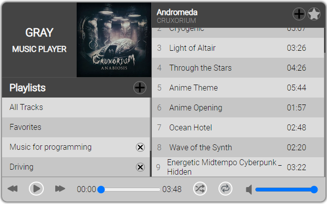

# List of Projects

Each project has a description file in its directory.

# Music Player

## Description

The Music Player with REST API is a web-based application that allows users to create and manage their playlists, add and delete tracks, and control playback functionality.

## Tools

JavaScript, Express.js, Node.js, and MySQL Workbench.

# Quiz Application

A web application that allows users to take a quiz and see their score. The application displays a series of questions with a selection of possible answers. Users select an answer, and the application checks if it's correct or not. The application keeps track of the user's score and displays it at the end of the quiz.

## Tools

JavaScript, Express.js, Node.js, MySQL

# Reddit-like Application

The Reddit-like page project is a web application that allows users to create, view, upvote, downvote, and delete posts on a forum-style website. The application uses EJS for templating, Express for routing, and MySQL for data storage.

## Tools

JavaScript, EJS, Express.js, Node.js, MySQL

# Todo-Angular

The ToDo application is a simple web application that allows users to manage their to-do lists. Users can easily add, edit, and delete their to-do items. The to-do items can be dragged and dropped from one column to another.

## Tools

Angular CLI, Angular Materials and Bootstrap.

# WeatherAppAngular

The Angular CLI weather application project is a web application. It allows users to search for and display current weather information for one or multiple cities. The application also provides the ability to delete a selected city.

## Tools

Angular CLI, Bootstrap

## Weather API

https://openweathermap.org/api
